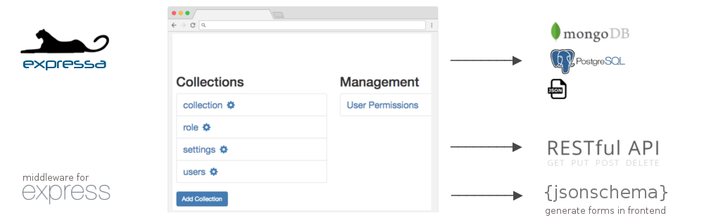

[](https://circleci.com/gh/thomas4019/expressa)

## data-driven extendable API middleware for Node.js/Express

Expressa makes it easy to create basic APIs by using [JSON schema](http://json-schema.org):

* django-like __admin interface__ for creating collection-__REST__ endpoints and managing permissions 
* collection schema's can be edited *and* added __through the admin interface__ 
* re-use collection schema's in your frontend to generate forms
* easily extendable so you can add complex features as well
* define collections as [JSON schema](http://json-schema.org) instead of custom code
* per-collection database storage: *MongoDB*, *PostgreSQL*, or *JSON-files* (useful for version control)

> Best of all: it's just middleware, not a framework 

* mix-and-mash: easily throw in other express middleware and endpoints 
* decorate expressa-endpoints: add event listeners which stop/modify requests (responses)

--------------------------------

## Getting Started

It's very easy to install expressa in your project directory:

    mkdir myapp
    cd myapp
    npm init
    npm install expressa expressa-admin express

Create a file `app.js` with the following code (or just copy the middle 3 lines into your existing express app)

    var express = require('express');
    var app = express();

    var expressa = require('expressa');         // 
    app.use('/api', expressa.api());            // optionally pass in settings
    app.use('/admin', expressa.admin());        // pass expressa.admin({ apiurl:'/myprefix' }) if you're running the api on another host or prefix

    app.listen(3000, function () {
      console.log('Example app listening on port 3000!');
    });

Now start the server by running `node --use-strict app.js` and navigate your browser to [http://localhost:3000/admin/](http://localhost:3000/admin/)

## API endpoints

Once you add a collections in the admin interface, every collection will have the following endpoints:

| method | endpoint                                     | description  |
|--------|----------------------------------------------|------------------------------------------------------------------------------------------------------------------------------------------------------------------------------------------------|
| POST   | /user/login                                  | expects JSON in the message body. e.g. `{"email": "email@example.com", password: "<the password>"}                                                                                             |
| GET    | /:collection                                 | get an array of all documents in a collection                                                                                                                                                  |
| GET    | /:collection/:id                             | get a specific document                                                                                                                                                                        |
| GET    | /:collection/?query={..}                     | get an array of documents matching the [mongo query](https://www.npmjs.com/package/mongo-query). For pagination append `&skip=0&offset=0&limit=6`                                              |
| GET    | /:collection/?query={..}&limit=10&page=1&orderby=["meta.created"] | same as previous, but with pagination support |
| GET    | /:collection/?query={..}&limit=10&offset=10 | same as previous, but with finergrained output control |
| GET    | /:collection/?fieldname=value                | get an array of documents matching with the specified values. See [node-mongo-querystring](https://github.com/Turistforeningen/node-mongo-querystring) for details.                            |
| GET    | /:collection/schema                          | get the collection schema                                                                                                                                                                      |
| POST   | /:collection/                                | create a new document, the message body should be the JSON document                                                                                                                            |
| PUT    | /:collection/:id                             | replace the document with id. The message body should be the JSON document. If the _id in document is different (the old document _id is deleted and a new one with id is created.)            |
| POST   | /:collection/:id/update                      | modify the document with id using a [mongo update query](https://docs.mongodb.com/manual/reference/method/db.collection.update/#update-parameter). The message body should be the update query |
| DELETE | /:collection/:id                             | delete the document                                                                                                                                                                            |

> Supported Data: Only standard JSON (strings, numbers, booleans, null) is supported. Dates can be stored as strings using [ISO 8601](https://en.wikipedia.org/wiki/ISO_8601)

Each object will contain this meta property which has autogenerated fields shared across all collection types:

```javascript
  "meta": {
    "created": "2016-05-16T23:56:11.615Z",
    "updated": "2016-05-16T23:56:28.262Z",
    "owner": "56cb5df7f56ef0b92f7b984b"
  },
```

## Documentation 

* [Usecase: creating a blog collection and post](doc/blogexample.md)
* [Querying (orderby)](doc/querying.md)
* [Authentication using JSON Web Tokens](doc/authentication.md)
* [Managing CRUD permissions](doc/permissions.md)
* [Modifying behavior using listeners](doc/listeners.md)
* [Accessing the database](doc/database.md)
* [Relationships](doc/relationships.md)
* [Online generated documentation + browser REST client](https://www.npmjs.com/package/expressa-swagger)
* [Testing / CI integrating your expressa app](doc/testing.md)
* [Uploading files](doc/uploading-files.md)

## Expressa ecosystem
* [expressa-folder](https://npmjs.org/package/expressa-folder) easily extend expressa collections with ORM-ish js-code (get.js/post.js/functions.js/etc) & setup sub-endpoints
* [expressa-swagger](https://npmjs.org/package/expressa-swagger) middleware to generate online api documentation
* [expressa-client](https://npmjs.org/package/expressa-client) middleware to generate browser REST-client (+nodejs client)
* [expressa-cli](https://npmjs.org/package/expressa-cli) commandline interface for expressa 

## Roadmap
* Automatic GraphQL Support
* JWT token expiration
* Support cookie based authentication as well
* File uploads

## Changelog

* Due to many changes, please test your site thoroughly after updating to 0.4 before releasing to production.

| version | important changes                                                  |
|---------|--------------------------------------------------------------------|
| 0.4.1   | db.create (postgres) now returns the id instead of the full document. |
| 0.4.0   | Pagination now starts with page 1. Delete requests can no longer bypass rejections by listeners. Updated permission error codes/messages. Error responses now always json (with an "error" field explaining) PUT /collection/:id response changed to match POST /collection |
| 0.3.3   | Fixes security vulnerability with the "edit own" permission and the :collection/:id/update endpoint. Update immediately. |
| 0.3.2   | Pagination is now supported by specifying the "page" and "limit"   |
| 0.3.1   | Makes "development" the default settings file instead of "production". Use NODE_ENV environmental variable to change this. To quickly migrate, just rename your settings file to "development".  |                                                       

## Inspired by

* [deployd](http://deployd.com/) (API design)
* [Django](https://www.djangoproject.com/) (admin UI)
* [Drupal](https://www.drupal.org/) (roles/permissions)
